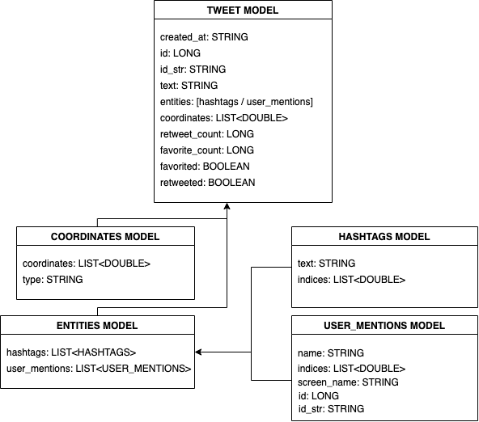

# Twitter CLI Application

## <ins>Introduction
The `Twitter Command Line Interface (CLI) Application` is capable of
posting, showing, and deleting a post on Twitter using the command line. 
Libraries such as `HTTP` and `OAuth 1.0` were used to send/receive/authenticate
requests using the Twitter Rest APIs. The Jackson library was used to convert JSON 
objects to Tweet objects. Moreover, Apache Maven was used to handle project 
dependencies, testing was done using `JUnit4` and `Mockito`, and the app was deployed 
using Docker.

__Targeted User:__ The product can be used by anyone who would like
to post | show | delete a tweet using command line interface. It 
will be especially useful for people who post regularly on Twitter.

__Technologies:__
> <span style = "color:green"> Git | Docker | Java SE 8 | Apache Maven | Twitter Rest API </span>

## <ins> Quick Start
Pull image from Docker

`docker pull deelango/twittercli`

Obtain your 
   <span style = "color:blue"> consumerKey </span> |
   <span style = "color:blue"> consumerSecret </span> |
   <span style = "color:blue"> accessToken </span> |
   <span style = "color:blue"> tokenSecret </span>
   from Twitter Developer's Portal
```
docker run --rm \
-e consumerKey= null \
-e consumerSecret= null \
-e accessToken= null \
-e tokenSecret= null \
deelango/twittercli post|show|delete [options]
```

#### Post
```
docker run --rm \
-e consumerKey= null \
-e consumerSecret= null \
-e accessToken= null \
-e tokenSecret= null \
deelango/twittercli post "message" latitude:longitude
```
#### Show 
```
docker run --rm \
-e consumerKey= null \
-e consumerSecret= null \
-e accessToken= null \
-e tokenSecret= null \
deelango/twittercli show id_of_tweet
```
#### Delete
```
docker run --rm \
-e consumerKey= null \
-e consumerSecret= null \
-e accessToken= null \
-e tokenSecret= null \
deelango/twittercli delete id_of_tweet
```

## <ins> UML Diagram


#### Description of the components


## <ins> Model
The following diagram will illustrate the `Tweet` model and its dependencies 
[`Coordinates`, `Entities`, `Hashtags`, and `UserMentions`]



## <ins> Spring

## <ins> Test
Testing for each module was done using `Junit4` and `Mockito`.

## <ins> Improvements
